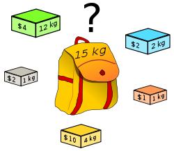

# Conference Scheduler Program


This is a we project which is developed with Spring Boot. It takes presentation items from user and creates a timetable for schedule program.


## Definition

* This applications is used to program events for one day with multiple rooms.
* Events / Presentations are entered by user with its type and time.
* Before creating schedule program, the following rules are applied.


    1. Conference will last 1 day
    2. There will be presentations in the morning and afternoon at the conference.
    3. Multiple presentations can be made at the same time, both in the morning and in the afternoon.
    4. Morning presentations start at 9:00 and end at 12:00.
    5. There will be lunch at 12:00.
    6. Afternoon presentations start at 13:00 and continue until networking. If there is no communication activity, it ends at 17:00.
    7. Communication events are held if time is left from the presentations. It cannot start before 16:00 and ends at 17:00 at the latest.
    8. Presentation times are in minutes or indicated as "lightning" (5 minutes. See: https: //en.wikipedia.org/wiki/Lightning_talk).
    9. There is no break between presentations.


## Running Conference Scheduler locally

### With maven command line
```
git clone https://github.com/mustafacalik/conference-scheduler.git
cd conference-scheduler
./mvnw spring-boot:run
```


## Database configuration

In its default configuration, Conference Scheduler uses an in-memory database (H2) .


## Application Screens

In order to add presentation items:

    1. Default page is accesed: http://localhost:8080/
    2. Presentation items are added one by one


In order to handle validation errors:

    1.Errors are followed with red frame on top of the main page.


In order to form schedule program:
    
    1. After presentation items are added, "Show Program" button is clicked


## Technical Details

To arrange the presentations in a appropriate way, "Knapsack" algorithm was used.



See: https://en.wikipedia.org/wiki/Knapsack_problem

### Definition of Problem:

Determine the number of each item to include in a collection so that the total weight is less than or equal to a given limit and the total value is as large as possible

### Application Solution:
If we can think that the items as presentations, total weights are presentations times and limit as the time
between morning to lunch, lunch to networking and networking to event end time, the problem is almost the same.

There is one difference that, in knapsack problem items are added according to their values. But in our problem there is no such thing.
As a result, we take presentation times as values and primarily higher values are considered during creating schedule program. 

